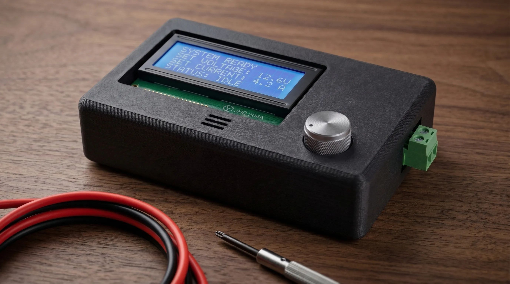
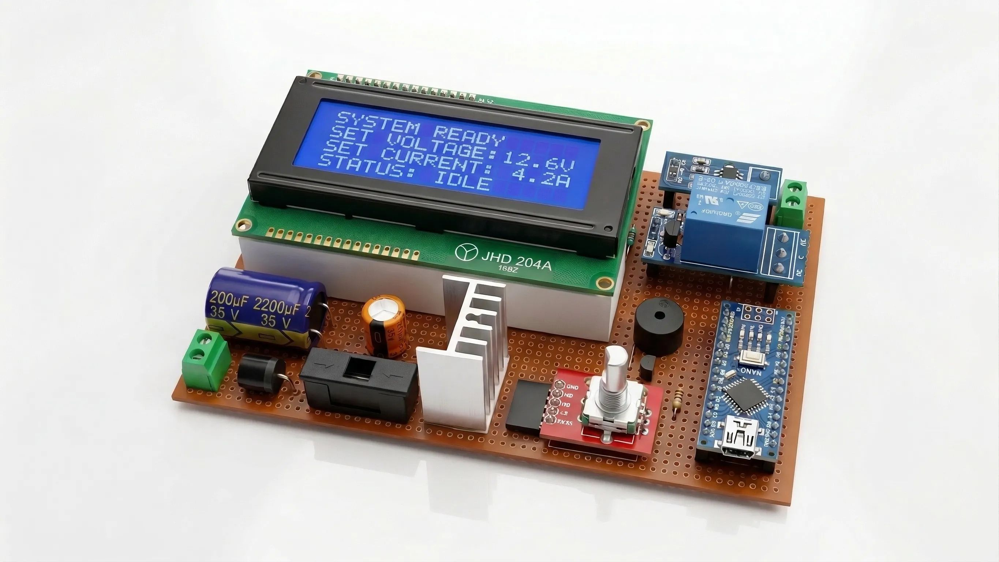
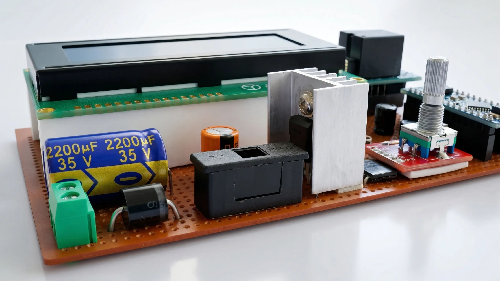

# Integrated DC Machine Protection and Health Monitoring System

## Executive Summary
The Integrated DC Machine Protection and Health Monitoring System is a real-time, microcontroller-driven solution designed to detect abnormal electrical conditions in DC machines. The system implements deterministic fault-handling logic to trigger immediate protective actions and provides live telemetry via a dedicated user interface.

## Problem Statement
DC motors in industrial and laboratory environments are frequently exposed to overload, overvoltage, and undervoltage conditions. Without active monitoring, these conditions can lead to thermal runaway, insulation failure, or permanent mechanical damage. Conventional protection often relies on passive components with significant response latency. This system addresses these challenges with a high-speed, configurable, and intelligent sensing loop.

## System Architecture
The architecture is structured into four distinct functional layers to ensure modularity and reliability:

1.  **Sensing Layer**: High-precision acquisition of current and voltage parameters using Hall-effect sensors and calibrated voltage dividers.
2.  **Processing Layer**: An ATmega328P-based control unit that evaluates real-time data against user-defined thresholds using a non-blocking event loop.
3.  **Actuation Layer**: Galvanically isolated load control via a high-current relay to physically disconnect the motor during fault conditions.
4.  **Feedback Layer**: A comprehensive interface comprising a 20x4 LCD, audible buzzer alerts, and a rotary encoder for dynamic field configuration.

### Internal Hardware Assembly
The following image demonstrates the internal layout, highlighting the high-current relay path, current sensor (ACS712) positioning, and the optoisolated logic interface.

## Technical Specifications

### Hardware Components
- **Control Unit**: ATmega328P Microcontroller
- **Current Sensing**: ACS712 Hall-Effect Sensor (Up to 30A peak)
- **Voltage Sensing**: Resistor divider network (47kΩ / 10kΩ)
- **Actuation**: 5V SPDT Relay (Optoisolated)
- **User Interface**: 20x4 Character LCD (I2C), Rotary Encoder with push-button
- **Alerts**: Piezoelectric Passive Buzzer

### Hardware Pin Mapping (ATmega328P)
| Component | Pin | Function |
| :--- | :--- | :--- |
| Voltage Sensor | A0 | Analog Input |
| Current Sensor | A1 | Analog Input |
| Rotary Encoder (CLK) | D2 | Interrupt-based monitoring |
| Rotary Encoder (DT) | D3 | Directional sensing |
| Rotary Encoder (Button) | D10 | Mode selection / Configuration |
| Buzzer Output | D8 | Audible notification |
| Relay Control | D5 | Digital Output (High/Low) |
| LCD (SDA/SCL) | A4 / A5 | I2C Communication |

## Firmware & Control Logic
The firmware is implemented in C++ using a non-blocking architecture to maintain high sampling rates and deterministic response times.

### Key Logic Features
- **Deterministic Sampling**: Continuous analog-to-digital conversion of electrical parameters.
- **Dynamic Thresholding**: Users can adjust upper and lower cut-off limits via the rotary encoder menu.
- **EEPROM Persistence**: (Planned/Implemented) Storage of user-defined thresholds to maintain settings across power cycles.
- **Fault Isolation**: Immediate relay disengagement within milliseconds of a threshold violation.

### Dependencies
- `ACS712.h` (Current sensor library)
- `LiquidCrystal_I2C.h` (Interfacing with 20x4 display)
- `Encoder.h` (Optimized rotary encoder handling)
- `PMButton.h` (Debounced button management)

## Key Features
- Real-time monitoring of both current and voltage levels.
- Configurable upper and lower protection thresholds.
- Immediate electronic isolation of the motor under fault conditions.
- Intuitive user interface for live telemetry and configuration.
- Robust, compact design suitable for industrial deployment.

### User Interface and Control Circuitry Protection
The system provides a clear, high-contrast display for real-time telemetry. The control circuitry is fortified with dedicated power regulation, fuse protection, and reverse-polarity safety mechanisms (independent of the motor's power supply), ensuring the stability and safety of the main switching logic.

## Engineering Outcome
The system has been validated under various load and fault conditions, demonstrating reliable detection of overcurrent and voltage fluctuations. By integrating sensing, logic, and actuation into a single cohesive unit, this project provides a professional-grade safety layer for DC machine operations.

[Explore full details of the Integrated DC Machine Protection and Health Monitoring System](https://anandps.in/projects/dc-machine-protection-system)

## Project Contributors
The system was designed and implemented by a cross-functional engineering team:

- **Reva Pradeep**
    - **Designation**: Business & Product Analyst
    - **Bio**: Product-focused professional with experience in business analysis and leading social initiatives. Combines analytical thinking with structured execution to drive outcomes. Brings a leadership mindset with a focus on problem-solving and impact.
    - **Links**: [LinkedIn](https://www.linkedin.com/in/reva-pradeep-248546202) | [GitHub](https://github.com/Reva-Pradeep) | [Email](mailto:revapradeep01@gmail.com)

- **Nesrin Anwer**
    - **Designation**: Signal & Data Analytics Developer
    - **Bio**: Electrical and electronics engineer integrating data analytics into system design. Focused on renewable energy, control systems, and signal processing. Driven by hands-on learning and structured problem-solving.
    - **Links**: [LinkedIn](https://www.linkedin.com/in/nesrin-anwer-a7b0b721a) | [GitHub](https://github.com) | [Email](mailto:nesrinanwer999@gmail.com)

- **Anand P S**
    - **Designation**: Firmware Systems Developer
    - **Bio**: Engineer specializing in distributed backend architectures, embedded systems, firmware development, and production-grade software design. Builds efficient, fault-tolerant systems with a focus on scalability and long-term maintainability.
    - **Links**: [LinkedIn](https://www.linkedin.com/in/anand-ps) | [GitHub](https://github.com/anand-ps) | [Email](mailto:anandps.dev@gmail.com)

---
© 2022 Anand P S. All rights reserved.